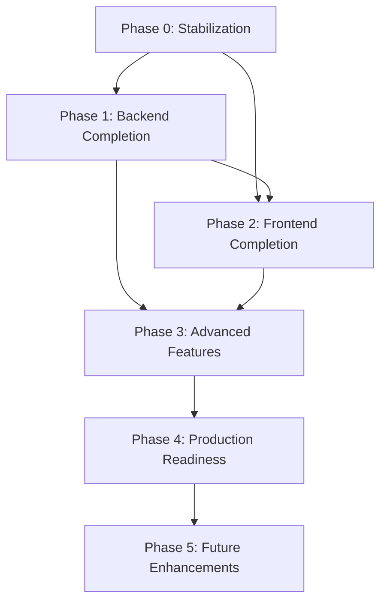

# Implementation Plan

## Property Declaration Management System — Phased Roadmap

**Based on:** [PRD.md](file:///d:/David/New-System/property-declaration-api/docs/PRD.md)  
**Last Updated:** 2026-09-25

---

## Phase 0: Stabilization & Security Hardening ⚡ (Priority: CRITICAL)

Fix security vulnerabilities and broken patterns in existing code before adding new features.

### 0.1 Protect Declaration Endpoints
- Apply `@UseGuards(JwtAuthGuard, RbacGuard)` to all `DeclarationsController` routes
- Add `@RequirePermissions('READ_DECLARATIONS')` on GET routes
- Add `@RequirePermissions('WRITE_DECLARATIONS')` on POST/PATCH routes
- Add `@RequirePermissions('DELETE_DECLARATIONS')` on DELETE route

### 0.2 Fix Frontend API Client
- Migrate `declarations-view.tsx` from `lib/api.ts` (no credentials) to RTK Query `declarationsApi` endpoints
- Remove or deprecate `app/api/declarations/` in-memory store (local Next.js mock)
- All API calls should go through `baseQueryWithReauth` for automatic token refresh

### 0.3 Fix Hardcoded Values
- Replace hardcoded sidebar user ("shadcn") with real authenticated user from Redux `authSlice`
- Move JWT secret to environment variable only (remove `'change-me-in-production'` fallback)
- Make CORS origins configurable via environment variable

### 0.4 Environment & Config
- Add `.env.example` for both projects
- Add health check endpoint `GET /health`
- Configure proper `DATABASE_URL` validation on startup

**Estimated effort:** 2–3 days

---

## Phase 1: Core Backend Completion 🔧 (Priority: HIGH)

### 1.1 User Management API
Create `UsersModule` with full CRUD:

| Endpoint | Method | Guard | Permission |
|----------|--------|-------|------------|
| `GET /api/users` | GET | JwtAuth + RBAC | READ_USERS |
| `GET /api/users/:id` | GET | JwtAuth + RBAC | READ_USERS |
| `PATCH /api/users/:id` | PATCH | JwtAuth + RBAC | WRITE_USERS |
| `DELETE /api/users/:id` | DELETE | JwtAuth + RBAC | DELETE_USERS |
| `POST /api/users/:id/roles` | POST | JwtAuth + RBAC | WRITE_USERS |
| `DELETE /api/users/:id/roles/:roleId` | DELETE | JwtAuth + RBAC | WRITE_USERS |

### 1.2 Pagination & Filtering
- Add `PaginatedResponse<T>` wrapper type
- Support `?page=1&limit=20&search=&sortBy=createdAt&order=desc` on list endpoints
- Apply to `GET /declarations` and `GET /users`

### 1.3 API Documentation
- Integrate `@nestjs/swagger` with OpenAPI 3.0
- Add `@ApiTags`, `@ApiOperation`, `@ApiResponse` decorators to all controllers
- Serve Swagger UI at `/api/docs`

### 1.4 Rate Limiting
- Add `@nestjs/throttler` for rate limiting
- Apply strict limits on `/auth/login` (5 attempts/minute) and `/auth/register` (3/minute)
- Apply moderate limits on general API routes

**Estimated effort:** 5–7 days

---

## Phase 2: Frontend Feature Completion 🎨 (Priority: HIGH)

### 2.1 Live Dashboard
- Create RTK Query endpoints for dashboard statistics:
  - Total declarations count
  - Declarations by month/year
  - Declarations by location
- Replace hardcoded `data.json` with live API data
- Add real-time section cards with actual counts

### 2.2 User Management Page (`/team`)
- User list table with search, pagination
- View user details (roles, permissions, creation date)
- Edit user roles (assign/revoke)
- Delete user (with confirmation dialog)
- Role-based visibility (only SUPER_ADMIN/ADMIN see this page)

### 2.3 Declarations RTK Query Migration
- Create `declarationsApi` RTK Query endpoints (list, get, create, update, delete)
- Replace `lib/api.ts` fetch calls in `declarations-view.tsx`
- Add optimistic updates and cache invalidation
- Add loading skeletons and error states

### 2.4 Role-Based UI
- Conditionally render sidebar items based on user permissions
- Hide edit/delete buttons for users without WRITE/DELETE permissions
- Show user role badge in sidebar footer

### 2.5 Profile / Account Page
- View own profile details
- Change password
- View active sessions

**Estimated effort:** 7–10 days

---

## Phase 3: Advanced Features 🚀 (Priority: MEDIUM)

### 3.1 Audit Trail
- Create `AuditLog` model in Prisma:
  - `userId`, `action` (CREATE/UPDATE/DELETE), `entity`, `entityId`, `changes` (JSON diff), `timestamp`
- Add Prisma middleware or service interceptor to auto-log mutations
- Add `GET /api/audit-logs` endpoint with filtering
- Add audit log viewer in frontend

### 3.2 Declaration Lifecycle / Workflow
- Implement the **Lifecycle** page with declaration status tracking:
  - `DRAFT` → `SUBMITTED` → `UNDER_REVIEW` → `APPROVED` / `REJECTED`
- Add `status` field to Declaration model
- Add status transition API endpoints
- Add approval/rejection workflow with comments

### 3.3 Document Attachments
- Add file upload support (scanned ID cards, land certificates)
- Store in cloud storage (S3/GCS) with metadata in DB
- Link attachments to declarations
- Preview/download in frontend

### 3.4 Analytics Page
- Declaration volume trends (line/bar charts)
- Breakdown by location, property type, status
- User activity metrics
- Export to CSV/PDF

### 3.5 Search & Filtering Enhancements
- Full-text search across declaration fields (Khmer text support)
- Advanced filters: date range, location, cert number, party name
- Saved filter presets

**Estimated effort:** 15–20 days

---

## Phase 4: Production Readiness 🏗️ (Priority: MEDIUM)

### 4.1 Testing
- Unit tests for AuthService, DeclarationsService
- Integration tests for API endpoints (supertest)
- Frontend component tests (React Testing Library)
- E2E tests (Playwright or Cypress)

### 4.2 DevOps & Deployment
- Dockerize both projects
- CI/CD pipeline (GitHub Actions)
- Environment-specific configurations (dev/staging/prod)
- Database migrations in CI

### 4.3 Monitoring & Logging
- Structured logging (Winston/Pino)
- Configure NestJS Observe properly (replace placeholder app keys)
- Error tracking (Sentry)
- Performance monitoring

### 4.4 Security Hardening
- CSRF protection
- Content Security Policy headers
- Input validation tightening
- SQL injection prevention audit
- Dependency vulnerability scanning

**Estimated effort:** 10–15 days

---

## Phase 5: Future Enhancements 🔮 (Priority: LOW)

- [ ] Multi-language UI toggle (Khmer / English)
- [ ] Email notifications (registration, password reset)
- [ ] Batch declaration import (CSV/Excel)
- [ ] Declaration templates
- [ ] Digital signatures
- [ ] Mobile-optimized declaration viewer
- [ ] GIS/Map integration for land plots
- [ ] Reporting module with PDF generation
- [ ] API versioning (v1, v2)
- [ ] WebSocket notifications for real-time updates

---

## Dependency Graph

---

## Summary Timeline

| Phase | Focus | Est. Duration | Priority |
|-------|-------|---------------|----------|
| Phase 0 | Security & Stabilization | 2–3 days | 🔴 CRITICAL |
| Phase 1 | Backend Completion | 5–7 days | 🟠 HIGH |
| Phase 2 | Frontend Completion | 7–10 days | 🟠 HIGH |
| Phase 3 | Advanced Features | 15–20 days | 🟡 MEDIUM |
| Phase 4 | Production Readiness | 10–15 days | 🟡 MEDIUM |
| Phase 5 | Future Enhancements | Ongoing | 🟢 LOW |

**Total estimated MVP (Phases 0–2): ~2–3 weeks**
